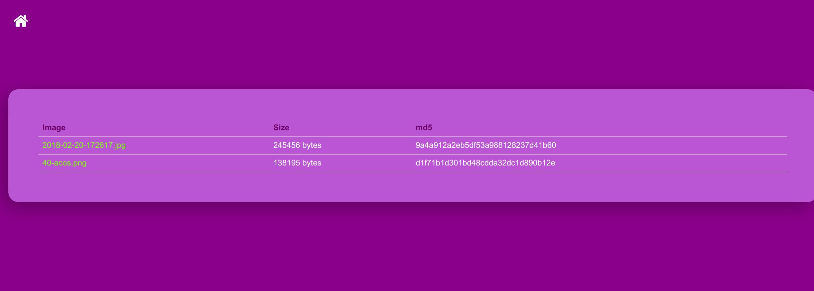

# Singularity Compose

This is a simple orchestration library for Singularity containers, akin to
Docker Compose. It is under development, and working for basic examples.

## Who is this intended for?

Singularity compose is intended to run a small number of container instances
on your host. It is *not* a complicated orchestration tool like Kubernetes,
but rather a controlled way to represent and manage a set of container instances,
or services.

## Getting Started

### singularity-compose.yml

For a singularity-compose project, it's expected to have a `singularity-compose.yml`
in the present working directory. You can look at a simple example here:

```yaml
version: "1.0"
instances:
  app:
    build:
      context: ./app
    volumes:
      - ./nginx.conf:/etc/nginx/conf.d/default.conf
      - ./app:/code
      - ./static:/var/www/static
      - ./images:/var/www/images
    ports:
      - 80:80
```

If you are familiar with [docker-compose](https://docs.docker.com/compose/) 
the file should look very familiar. A key difference is that instead of 
"services" we have "instances." And you guessed correctly - each 
section there corresponds to a 
[Singularity instance](https://sylabs.io/guides/3.2/user-guide/running_services.html)
that will be created. In this guide, we will walk through each of the sections
in detail.

### Instance folders

Generally, each section in the yaml file corresponds with a container instance to be run, 
and each container instance is matched to a folder in the present working directory.
For example, if I give instruction to build an `nginx` instance from
a `nginx/Singularity.nginx` file, I should have the
following in my singularity-compose:

```
  nginx:
    build:
      context: ./nginx
      recipe: Singularity.nginx
```

The above says that I want to build a container and corresponding instance
named `nginx`, and use the recipe `Singularity.nginx` in the context
folder `./nginx` in the present working directory. This gives me the following
directory structure:

```bash
singularity-compose-example
├── nginx
...
│   ├── Singularity.nginx
│   └── uwsgi_params.par
└── singularity-compose.yml

```

Notice how I also have other dependency files for the nginx container
in that folder.  While the context for starting containers with Singularity
compose is the directory location of the `singularity-compose.yml`,
the build context for this container is inside the nginx folder.
We will talk about the [build command](commands.md) soon. First,
as another option, you can just define a container to pull,
and it will be pulled to the same folder that is created if it doesn't exist.

```
  nginx:
    image: docker://nginx
```

This will pull a container `nginx.sif` into a `nginx` context folder:

```bash
├── nginx                    (- created if it doesn't exist
│   └── nginx.sif            (- named according to the instance
└── singularity-compose.yml
```

It's less likely that you will be able to pull a container that is ready to
go, as typically you will want to customize the 
[startscript](https://sylabs.io/guides/3.2/user-guide/definition_files.html#startscript) 
for the instance. Now that we understand the basic organization, let's
bring up some instances.

## Quick Start

For this quick start, we are going to use the 
[singularity-compose-simple](https://www.github.com/singularityhub/singularity-compose-simple) 
example. Singularity has a networking issue that currently doesn't allow communication
between multiple containers (due to iptables and firewall issues) so for now the most we
can do is show you one container. First, install singularity-compose from pip:

```bash
$ pip install singularity-compose
```

Then, clone the repository:

```bash
$ git clone https://www.github.com/singularityhub/singularity-compose-simple
```

cd inside, and you'll see a `singularity-compose.yml` like we talked about.

```bash
$ cd singularity-compose-simple
$ ls
app  images  LICENSE  nginx.conf  README.md  singularity-compose.yml  static
```

Let's take a look at the `singularity-compose.yml`

```yaml
version: "1.0"
instances:
  app:
    build:
      context: ./app
    volumes:
      - ./nginx.conf:/etc/nginx/conf.d/default.conf
      - ./app/nginx/uwsgi_params.par:/etc/nginx/uwsgi_params.par
      - ./app/nginx/cache:/var/cache/nginx
      - ./app/nginx/run:/var/run
      - ./app:/code
      - ./static:/var/www/static
      - ./images:/var/www/images
    ports:
      - 80:80
...
```

It defines a single service, `app`, which has both a Django application and
a nginx server with the [nginx-upload module](https://www.nginx.com/resources/wiki/modules/upload/) enabled.
It tells us right away that the folder `app` is the context folder, and inside we can
see dependency files for nginx and django.

```bash
$ ls app/
manage.py  nginx  requirements.txt  run_uwsgi.sh  Singularity  upload...
```

What we don't see is a container. We need to build that from the Singularity recipe.
Let's do that.

```bash
$ singularity-compose build
```

Will generate an `app.sif` in the folder:

```bash
$ ls app/
app.sif manage.py  nginx  requirements.txt  run_uwsgi.sh  Singularity  upload...
```

And now we can bring up our instance!

```bash
$ singularity-compose up
```

Verify it's running:

```bash
$ singularity-compose ps
INSTANCES  NAME PID     IMAGE
1           app	20023	app.sif
```

And then look at logs, shell inside, or execute a command.

```bash
$ singularity-compose logs app
$ singularity-compose logs app --tail 30
$ singularity-compose shell app
$ singularity-compose exec app uname -a
```

When you open your browser to [http://127.0.0.1](http://127.0.0.1)
you should see the upload interface. 


If you drop a file in the box (or click
to select) we will use the nginx-upload module to send it directly to the
server. Cool!



This is just a simple Django application, the database is sqlite3, and it's
now appeared in the app folder:

```bash
$ ls app/
app.sif  db.sqlite3  manage.py  nginx  requirements.txt  run_uwsgi.sh  Singularity  upload  uwsgi.ini
```

The images that you upload are stored in `images` at the root:

```bash
$ ls images/
2018-02-20-172617.jpg  40-acos.png  _upload 
```

And static files are in `static`.

```bash
$ ls static/
admin  css  js
```

Finally, the volumes that we specified in the `singularity-compose.yml`
tell us exactly where nginx and the application need write. The present
working directory (where the database is written) is bound to the
container at `/code`, and nginx dependencies are bound to locations
in `/etc/nginx`. Notice how the local static and images folder are bound
to locations in the container where we normally wouldn't have write.

```bash
    volumes:
      - ./nginx.conf:/etc/nginx/conf.d/default.conf
      - ./app/nginx/uwsgi_params.par:/etc/nginx/uwsgi_params.par
      - ./app/nginx/cache:/var/cache/nginx
      - ./app/nginx/run:/var/run
      - ./app:/code
      - ./static:/var/www/static
      - ./images:/var/www/images
```

This is likely a prime different between Singularity and Docker compose - Docker doesn't need
binds for write, but rather to reduce isolation. When you develop an application,
a lot of your debug will come down to figuring out where the services need to write
log and similar files, which you might not have been aware of when using Docker.

Continue below to read about networking, and see these commands in detail.

## Networking

When you bring the container up, you'll see generation of an `etc.hosts` file,
and if you guessed it, this is indeed bound to `/etc/hosts` in the container.
Let's take a look:

```bash
10.22.0.2	app
127.0.0.1	localhost

# The following lines are desirable for IPv6 capable hosts
::1     ip6-localhost ip6-loopback
fe00::0 ip6-localnet
ff00::0 ip6-mcastprefix
ff02::1 ip6-allnodes
ff02::2 ip6-allrouters
```

This file will give each container that you create (in our case, just one)
a name on its local network. Singularity by default creates a bridge for
instance containers, which you can conceptually think of as a router,
This means that, if I were to reference the hostname "app" in a second container,
it would resolve to `10.22.0.2`. Singularity compose does this by generating
these addresses before creating the instances, and then assigning them to it.
If you would like to see the full commands that are generated, run the up
with `--debug` (binds and full paths have been removed to make this easier to read).

```bash
$ singularity instance start \
    --bind /home/vanessa/Documents/Dropbox/Code/singularity/singularity-compose-simple/etc.hosts:/etc/hosts \
    --net --network-args "portmap=80:80/tcp" --network-args "IP=10.22.0.2" \
    --hostname app \
    --writable-tmpfs app.sif app
```

Control and customization of these instances is probably the coolest (and not widely
used) feature of Singularity. You can create your own network configurations,
and customie the arguments to the command. Read [here](https://sylabs.io/guides/3.2/user-guide/running_services.html) for more detalis.

## Commands

Read more about the commands shown above [here](commands.md#commands). For the
Python API, see [here](/singularity-compose/api/).

## Specification

The [specification](spec/) describes in more detail the sections of the singularity-compose.yml.
For example, in the quick start above, we have a post command for the app instance
that creates a series of folders on the host. 

